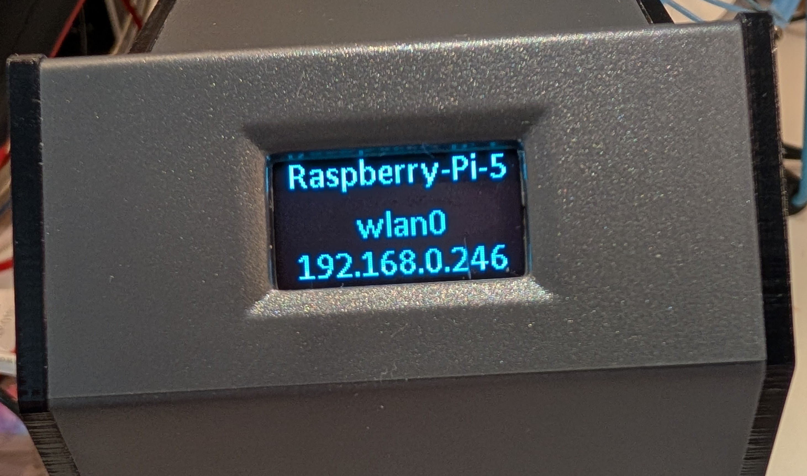
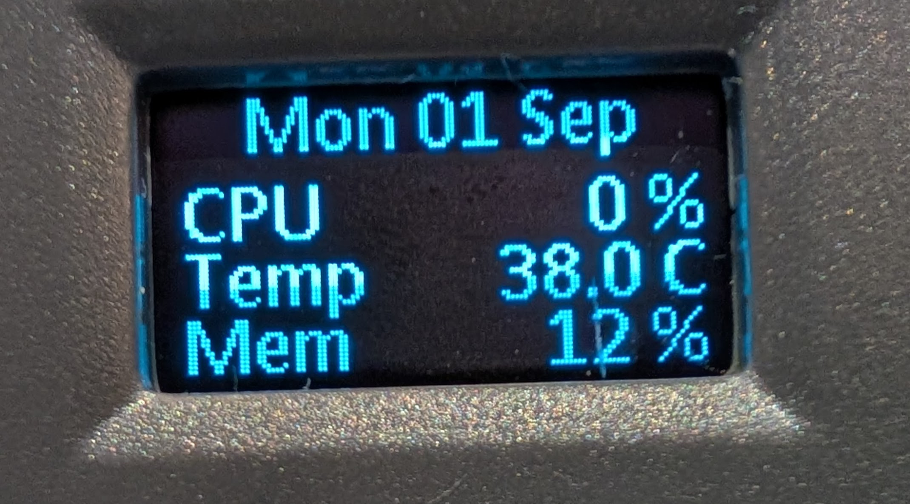
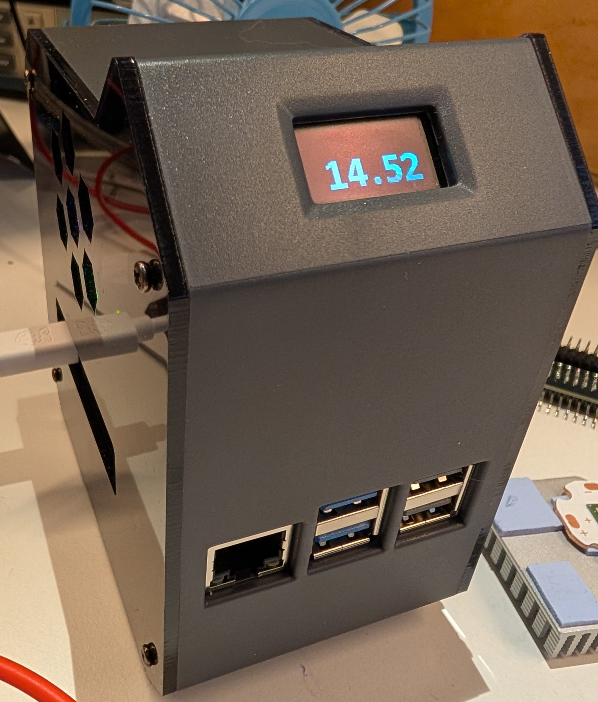

# PiMonitor

PiMonitor is a lightweight tool for displaying Raspberry Pi system status on an SSD1306 OLED display connected via the I2C interface. It provides real-time monitoring of system metrics, such as CPU usage, memory, temperature, or other status information, directly on the OLED screen.

Originally developed for the [52Pi Mini Tower Case](https://www.52pi.com/products/mini-tower-kit-for-raspberry-pi-4b?_pos=1&_sid=6c7e7b3f4&_ss=r), PiMonitor is compatible with any Raspberry Pi or similar system equipped with an SSD1306 OLED display on the I2C interface.

## Features
- Displays system status (e.g., CPU, memory, temperature) on an SSD1306 OLED display.
- Lightweight and written in C for efficiency. 
- Easy to install - Requires no special drivers, font files or libraries
- Developed for the 52Pi Mini Tower Case but works with any compatible setup.

## Screenshots
### Startup screen
Displayed for 15 seconds on startup. Shows the hostname, network port and IPv4 Address
<br><br>


### Status Screen
Shows the current time & date, CPU utilisation percentage, CPU temperature in degrees Celcius and memory utilisation percent
<br><br>


### Screen Saver
After the cpu usage, temperature and memory usage have been low for a few minutes, the screen saver 
will start up to reduce oled burn-in. This displays the current time with reduced brightness, 
changing position every minute
<br><br>



## Requirements
- Raspberry Pi (any model) or similar single-board computer.
- SSD1306 OLED display connected via the I2C interface.
- Linux-based operating system (e.g., Raspberry Pi OS).
- I2C enabled on your system (`raspi-config` can be used to enable it).
- GCC and Make for building the program.
- Systemd for running PiMonitor as a service.

## Installation
1. run sudo raspi-config and ensure that the i2c interface is enabled
   
2. Clone the repository:
```
git clone https://github.com/g0hjq/pimonitor.git<br>
(or copy files pimonitor.c and makefile to a local directory)
```
4. Install dependencies
```
sudo apt install libi2c-dev
```

6. Compile the program
```
make
```

7. Test the program
```
./pimonitor
```

8. Install the program to /usr/local/bin and set up the systemd service<br>
```
sudo make install-service
```

## Uninstallation
To remove PiMonitor and its systemd service
```
sudo make uninstall
```

## Compatibility
- Hardware: Works with any Raspberry Pi or system with a SSD1306 OLED display connected via I2C. Originally designed for the 52Pi Mini Tower Case.
- I2C Setup: Ensure I2C is enabled (use raspi-config → Interfacing Options → I2C → Enable).
- Dependencies: Uses the standard Linux tools (gcc, make) and I2C libraries (e.g., libi2c-dev)


   
